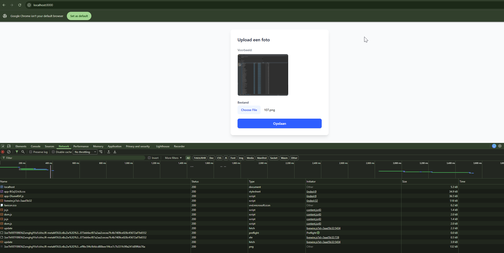
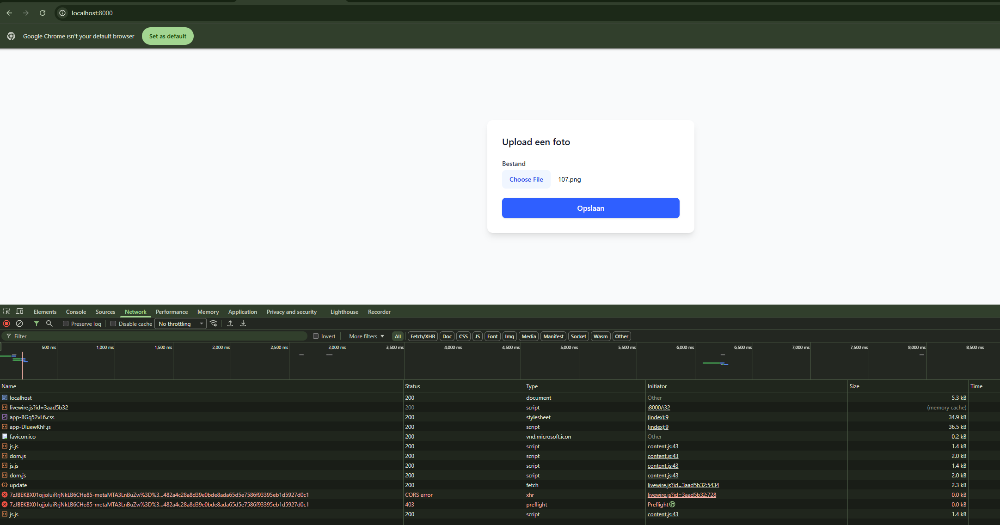

# S3 POC

# Bucket settings
```shell
aws --profile cyso s3api put-bucket-cors --bucket s3-poc --cors-configuration '{
    "CORSRules": [
        {
            "AllowedOrigins": ["http://localhost:8000"],
            "AllowedMethods": ["GET", "PUT"],
            "AllowedHeaders": ["*"],
            "ExposeHeaders": ["ETag"],
            "MaxAgeSeconds": 3000
        }
    ]
}
```

# Installation

## Native
```shell
npm ci && npm run bvuild
composer install
php artisan serve
```


## Docker
```shell
docker compose run --rm composer
docker compose run --rm npm
docker compose up php
```


# How to test

1. Go to http://localhost:8000
2. Open your browsers Inspector to your network tab
3. Select an image (1MB or less)
4. After the update call 2 calls are made to https://core.fuga.cloud:8080 , these wil give one of 2 results:
   1. File sucessfully uploaded (200), image is shown in the screen
      
   2. File upload fails (403)
      
5. Refresh the page and try again, it will fail sometimes at random

# Analysis

It looks like the Ceph Cluster randomly accepts the query parameter `x-amz-acl=private` and the signature matches. Other times this is filtered out and the signature no longer matches the given parameters resulting in a 403 error. 

# Temporary fix
A temporary fix we apply is commenting out `vendor/livewire/livewire/src/Features/SupportFileUploads/GenerateSignedUploadUrl.php:40` (`'ACL' => $visibility,`)

See: https://github.com/livewire/livewire/discussions/4538
